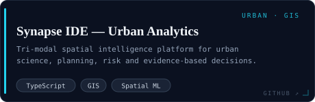
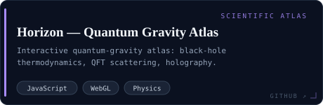
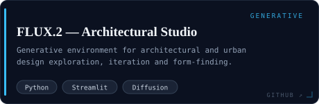

<!--
  MUSTAFA RAŞİT ŞAHİN — RESEARCH PROFILE
  Design system: "scientific instrument" — deep-space navy, cyan/violet accents,
  serif display + monospace data. All artwork is generated deterministically:
  python3 scripts/generate_assets.py  →  assets/*.svg
-->

 

  

  

<i>“Cities have the capability of providing something for everybody, only because, and only when, they are created by everybody.”</i> 
— Jane Jacobs, <i>The Death and Life of Great American Cities</i>, 1961

---

<h2 align="center"><code>01</code>&nbsp;·&nbsp;ABSTRACT</h2>

<blockquote>

I develop <strong>theoretical and computational frameworks</strong> for understanding and transforming urban systems — drawing on statistical mechanics, complexity theory, fractal geometry and space syntax. My research measures <strong>urban morphology, spatial complexity and resilience</strong>; analyses the transition from closed, top-down plans to adaptive and participatory planning; and integrates agriculture and food systems into urban design.

On GitHub, these themes become <strong>computational instruments</strong>: decision dashboards, retrieval-augmented systems, multi-modal pipelines (text · audio · video · spatial), simulations and agent-based models, and visualisations built for researchers and policy makers.

<strong>Keywords</strong> — <em>sub-fractal scaling · urban morphology · space syntax · statistical mechanics · dual-phase modelling · adaptive capacity · RAG · agentic AI</em>

<strong>In progress</strong> — regime-conditioned urban morphology · belief emergence · quantum-gravity atlas

</blockquote>

<h2 align="center"><code>02</code>&nbsp;·&nbsp;RESEARCH&nbsp;PROGRAMME</h2>

<table>
<tr>
<td width="33%" align="center" valign="top">
  
<strong>Urban Complexity</strong> 
Sub-fractal and dual-phase analyses of urban form — measuring how cities scale, adapt and transition between morphological regimes.
</td>
<td width="33%" align="center" valign="top">
  
<strong>Spatial Intelligence</strong> 
GIS-native analytics and regime-conditioned models that turn spatial data into audit-ready evidence for planning decisions.
</td>
<td width="33%" align="center" valign="top">
  
<strong>Agentic Systems</strong> 
Multi-model AI workbenches — IDEs, RAG platforms and simulation engines — that operationalise research as usable software.
</td>
</tr>
</table>

---

<h2 align="center"><code>03</code>&nbsp;·&nbsp;INSTRUMENTATION&nbsp;—&nbsp;SELECTED&nbsp;SYSTEMS</h2>

<table>
<tr>
<td width="50%">
  
</td>
<td width="50%">
  
</td>
</tr>
<tr>
<td>
  
</td>
<td>
  
</td>
</tr>
<tr>
<td>
  
</td>
<td>
  
</td>
</tr>
</table>

<strong>Also in the lab</strong> — <a href="https://github.com/mustafaras/periodic-intelligence-lab">Periodic Intelligence Lab</a> · <a href="https://github.com/mustafaras/cytoatlas-pro-3d">CytoAtlas Pro 3D</a> · <a href="https://github.com/mustafaras/solar">Solar Observatory</a> · <a href="https://github.com/mustafaras/Synapse_IDE_PSYCHIATRY">Synapse IDE — Psychiatry</a> · <a href="https://github.com/mustafaras/MEDIGENIUSAI">Medigenius AI</a> · <a href="https://github.com/mustafaras/echoforge_whisper">EchoForge</a> · <a href="https://github.com/mustafaras/Neuro-Clarity_Psychiatric_Psychologic_moodtracking">Neuro-Clarity</a> · <a href="https://github.com/mustafaras/AURA-Local-Voice-Agent-Premium-Pack">AURA</a> · <a href="https://github.com/mustafaras/s">ŞEYMA · ÆON</a>

---

<h2 align="center"><code>04</code>&nbsp;·&nbsp;TELEMETRY</h2>

 

  

<picture>
  <source media="(prefers-color-scheme: dark)" srcset="https://raw.githubusercontent.com/mustafaras/mustafaras/output/github-contribution-grid-snake.svg" />
  <source media="(prefers-color-scheme: light)" srcset="https://raw.githubusercontent.com/mustafaras/mustafaras/output/github-contribution-grid-snake.svg" />
  
</picture>

---

<h2 align="center"><code>05</code>&nbsp;·&nbsp;SELECTED&nbsp;PUBLICATIONS&nbsp;&amp;&nbsp;TALKS</h2>

- <code>2025</code> &nbsp;**Urban complexity: Izmir's adaptive capacity through sub-fractal difference analysis** — *Environment and Planning B: Urban Analytics and City Science* · [doi:10.1177/23998083251379282](https://doi.org/10.1177/23998083251379282)
- <code>2025</code> &nbsp;**Advanced Quantification of Urban Complexity and Adaptive Capacity: Sub-Fractal Analysis and Spatial Statistics in Izmir** — *AESOP 2025, Istanbul* · presentation
- <code>2025</code> &nbsp;**Exploring Regionalization and Centralization in Izmir: A Dual-Phase Analysis of Urban Morphology Using Sub-Fractal and Space Syntax Methods** — *AESOP 2025, Istanbul* · poster
- <code>2025</code> &nbsp;**How Can Urban Planners in Türkiye Foster Stronger Connections with the Agricultural/Food Sector While Transitioning from Closed Plans to Open Plans?** — *Journal of Planning* · [doi:10.14744/planlama.2024.52386](https://doi.org/10.14744/planlama.2024.52386)
- <code>2024</code> &nbsp;**Dijitalleşen Araçlarda Kentsel Karmaşıklığın Ölçülmesi ve Alt-Fraktal Analizlerin Mekansal İstatistiği** — *8 Kasım Dünya Şehircilik Günü 47. Kolokyumu* · presentation
- <code>2024</code> &nbsp;**Transition from Traditional Urban Models to Complex System Models** — *Journal of Planning* · [doi:10.14744/planlama.2024.38243](https://doi.org/10.14744/planlama.2024.38243)
- <code>2023</code> &nbsp;**Conceptualizations of Urban, Rural and Region in "Urban Age"** — *Architectural Sciences and Recent Approaches and Trends in Urban and Regional Planning* · book chapter
- <code>2023</code> &nbsp;**İzmir Bölgesinin Merkezileşme Eğilimlerinin Alt-fraktal Analiz Yöntemiyle İrdelenmesi** — *23. Ulusal Bölge Bilimi ve Bölge Planlama Kongresi* · conference paper

📎 Full list of works and software — <a href="https://orcid.org/0009-0001-4809-3950"><strong>ORCID 0009-0001-4809-3950</strong></a>

---

<h2 align="center"><code>06</code>&nbsp;·&nbsp;TOOLBOX</h2>

| Domain | Instruments |
|---|---|
| **Quantitative & modelling** | Fractal / sub-fractal analysis · spatial statistics · hotspot & cluster analysis · statistical mechanics · time series · regression & GLM · Monte Carlo · agent-based simulation |
| **Programming & data** | Python · TypeScript · JavaScript · PyTorch · Pandas · NumPy · Jupyter · PostgreSQL · SQLite · FastAPI · REST APIs |
| **AI & language models** | LLM integration · RAG · prompt engineering · multi-model orchestration · multimodal pipelines · Whisper transcription · evaluation & benchmarking |
| **Spatial & design** | GIS · QGIS · urban design & planning · map design · dashboard design · 3D modelling · CGI & visualisation |
| **Platforms & devops** | React · Next.js · Node.js · Vite · Streamlit · Docker · GitHub Actions · Git · VS Code · Linux |
| **Scholarship** | Academic writing · peer review (Heliyon, Land Use Policy) · conference presentations · studio & course instruction · interdisciplinary projects |

---

